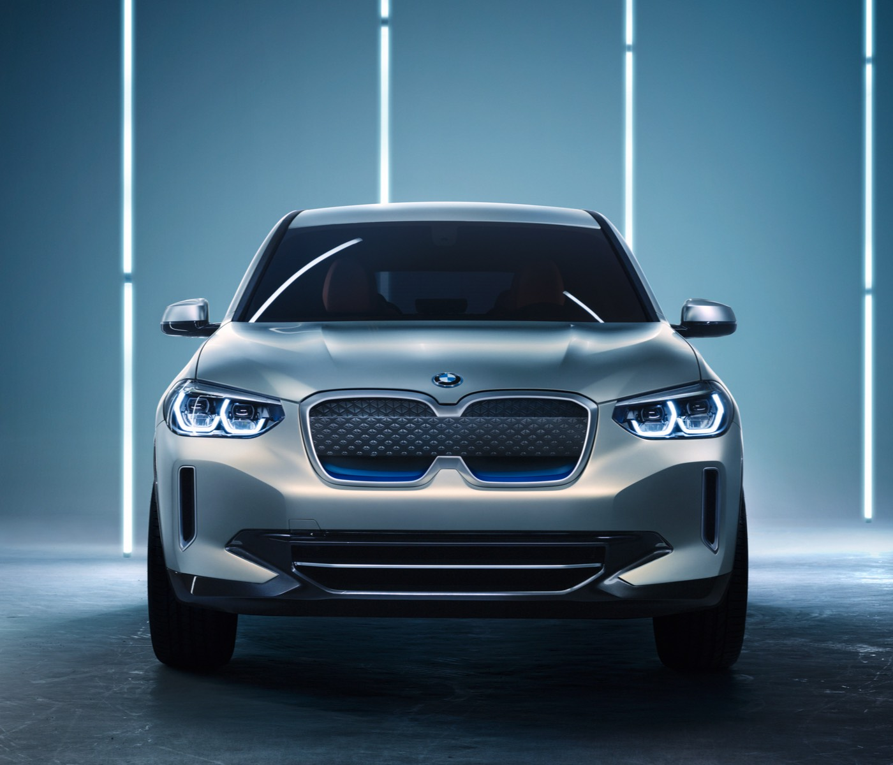
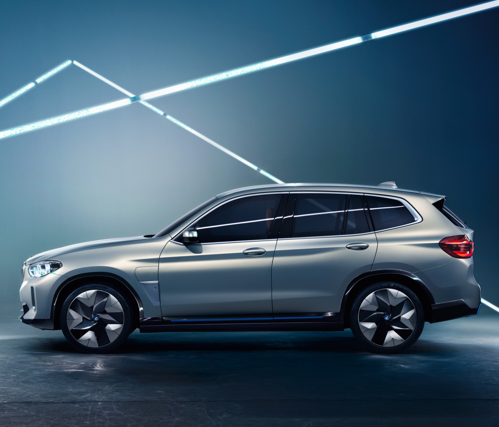
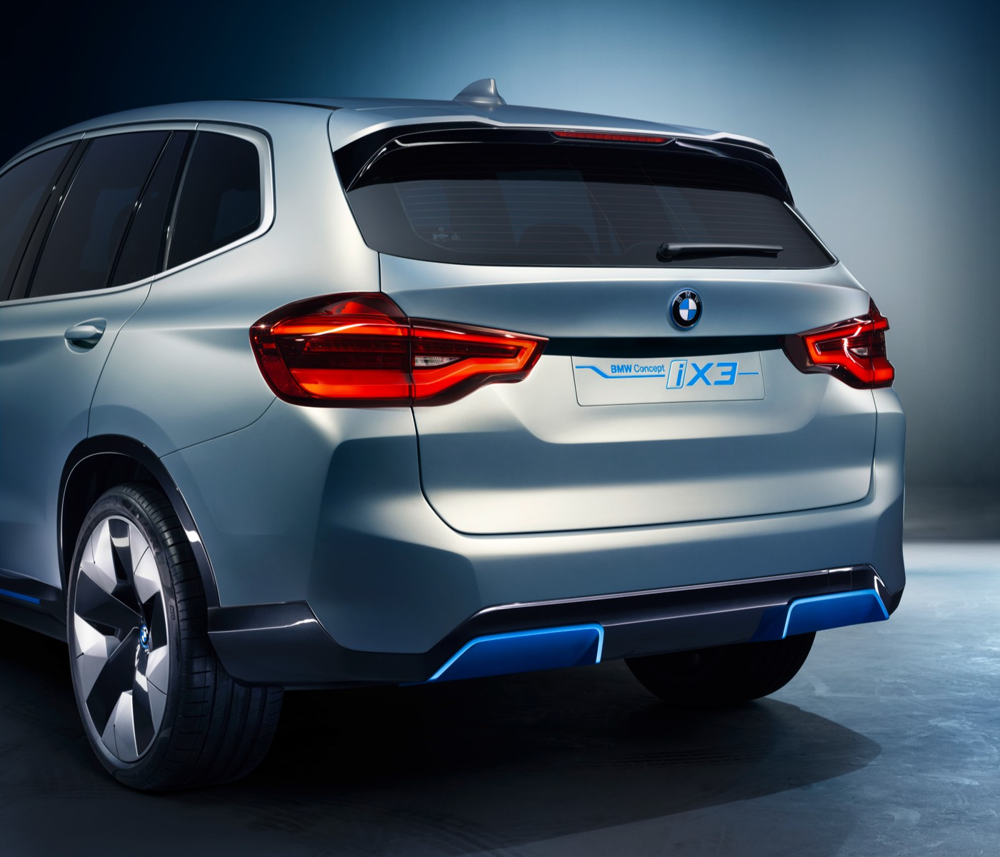
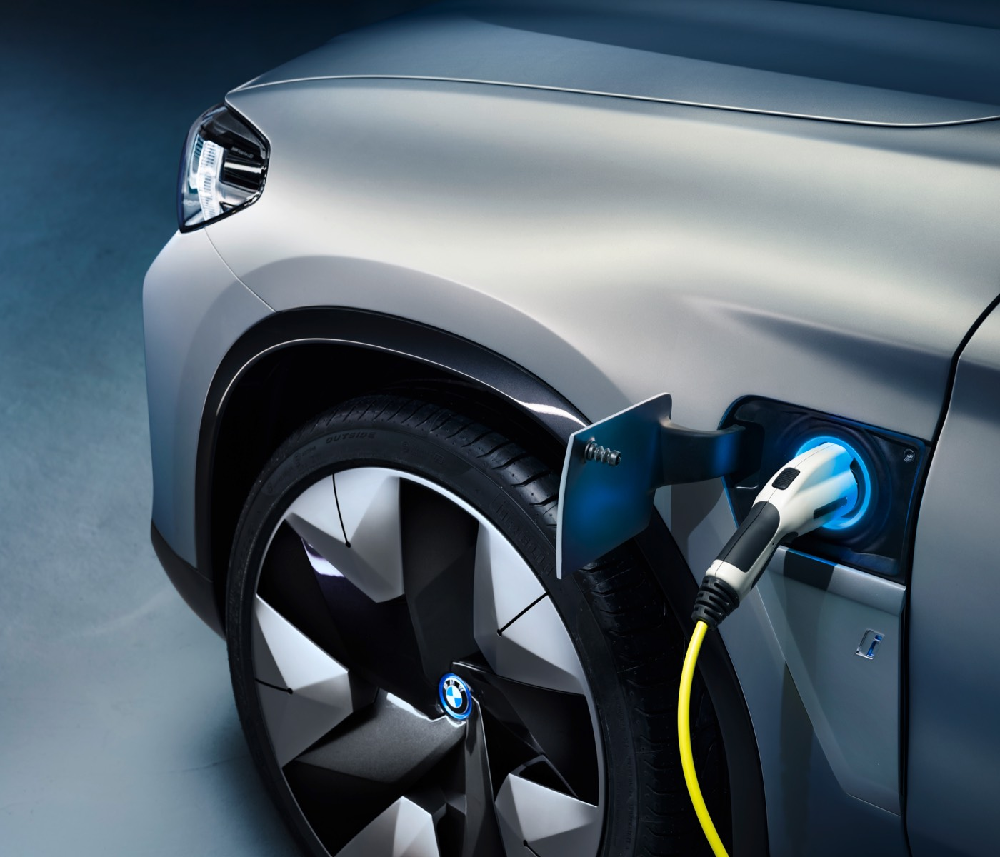

###With its 270 horsepower and around 250 miles of range, the all-electric iX3 will mark the beginning of a new chapter in BMW's electrification strategy.
<!-- end -->

The iX3 will be a full-electric version of the SUV BMW X, which is what the “electrification strategy” is all about: In the future you will be able to select a battery-electric engine in any BMW model. 

The car will have fifth generation BMW eDrive technology and a battery with 70+ kWh of net capacity, the iX3 battery should  should be charged in 30 minutes with 150 kW quick charger.

| Engine     | Base price    | Available  |
| ------------- | -------------:| ------- |
| Battery electric | TBA           | 2020     |

####Read more
- [25.04.2018 Press Release, The BMW Concept iX3](https://www.press.bmwgroup.com/global/article/detail/T0280363EN/the-bmw-concept-ix3?language=en)
- [BMW Concept iX3 overview (in Norwegian) ](https://www.bmw.no/no/all-models/bmw-i/iX3/2018/oversikt.html)

####Images

