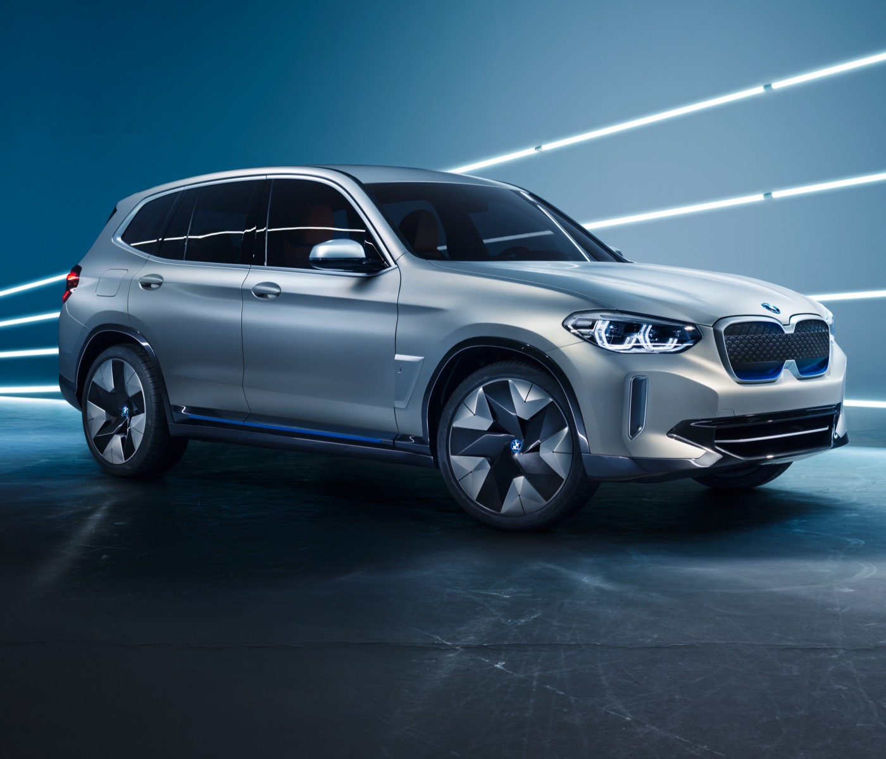

###With its 270 horsepower and around 250 miles of range, the all-electric iX3 will mark the beginning of a new chapter in BMW's electrification strategy.

The iX3 will be a full-electric version of the BMW X, similar in design except for a grille-free nose and a few discrete “electric” details. This is the core of BMW's new “electrification strategy – you are supposed to be able to select a battery-electric engine for any BMW model in the future. 

With fifth generation BMW eDrive technology and a battery of 70+ kWh net capacity, the iX3 will be charged in 30 minutes with a 150 kW quick charger. Production scheduled to start in 2020. 

| Engine     | Base price    | Available  |
| ------------- | -------------:| ------- |
| Battery electric | TBA           | 2020     |

####Read more
- [25.04.2018 Press Release, The BMW Concept iX3](https://www.press.bmwgroup.com/global/article/detail/T0280363EN/the-bmw-concept-ix3?language=en)

