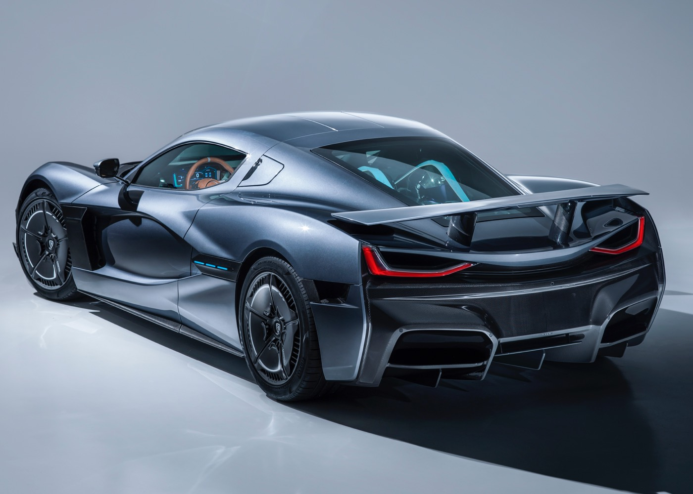

###The Taycan was previously known as the “Mission E” concept study. 

«Two permanently excited synchronous motors (PSM) with a system output of over 600 hp (440 kW) accelerate the electric sports car to 100 km/h in well under 3.5 seconds and to 200 km/h in under twelve seconds. This performance is in addition to a continuous power level that is unprecedented among electric vehicles: Multiple jump starts are possible in succession without loss of performance, and the vehicle’s maximum range is over 500 km in accordance with the NEDC.»

| Engine     | Base price    | Available  |
| ------------- | -------------:| ------- |
| Battery electric | £70000          | 2020     |

####Read more
- [Rimac C_Two Microsite](ctwo.rimac-automobili.com/)

####Images

